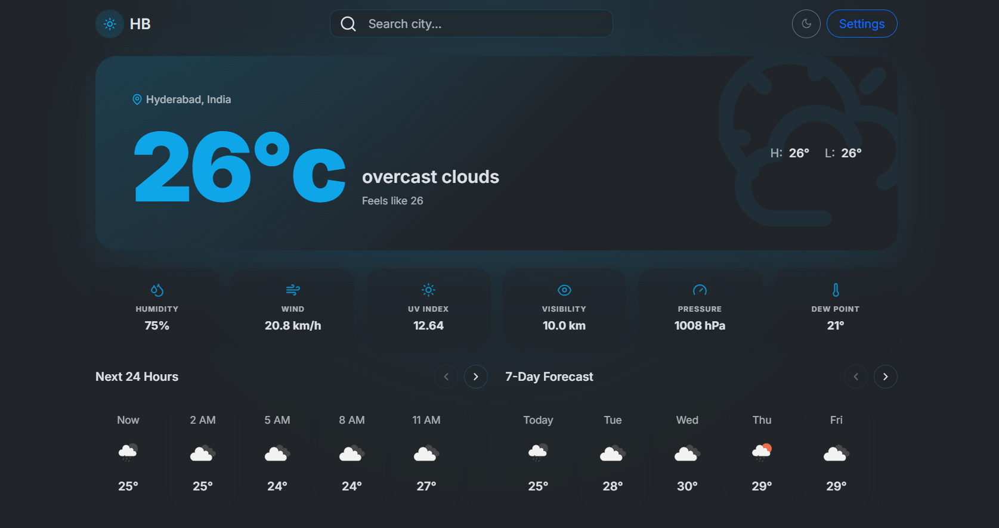
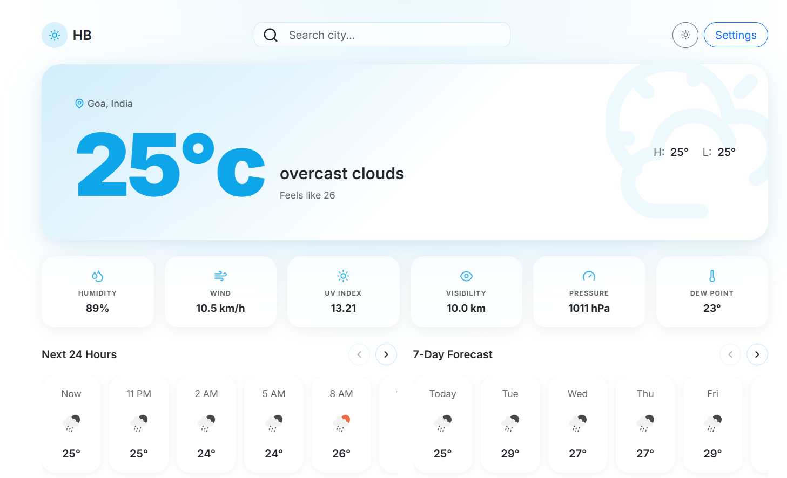

# 🌦️ HB Weather Dashboard

A modern, responsive weather dashboard built with **HTML5, SCSS, Bootstrap 5, and Vanilla JavaScript**. It provides real-time weather conditions, hourly forecasts, and a 7-day weather forecast for cities worldwide using the OpenWeather API.

> Designed with a clean UI, dark/light theme support, automatic location detection, and responsive layouts for desktop and mobile devices.

---
## 📸 Preview

### 🌙 Dark Mode



### ☀️ Light Mode


---

## 🚀 Live Demo

<a href="https://bandari-harish.github.io/HB-WEATHER-DASHBOARD/" target="_blank">
    🌐 Live Demo
</a>


---

## ✨ Features

- 🌍 Search weather by city name
- 📍 Automatic location detection using IP
- 🌡️ Real-time weather information
- 🕒 Next 24-hour weather forecast
- 📅 7-day weather forecast
- 💧 Humidity
- 🌬️ Wind Speed
- ☀️ UV Index
- 👀 Visibility
- 🌡️ Dew Point
- 🌪️ Atmospheric Pressure
- 🌅 Sunrise & Sunset support
- 🌙 Dark & Light Theme
- 📱 Fully Responsive Design
- ⚡ Fast API-based weather updates
- 🎨 Modern glassmorphism-inspired UI

---

## 🛠️ Tech Stack

| Technology | Usage |
|------------|-------|
| HTML5 | Structure |
| SCSS | Styling |
| Bootstrap 5 | Responsive Layout |
| JavaScript (ES6+) | Application Logic |
| OpenWeather API | Weather Data |
| IPInfo API | Automatic Location Detection |
| GitHub Pages | Deployment |

---

## 📂 Project Structure

```
HB-WEATHER-DASHBOARD
│
├── assets/
│   ├── icons/
│   ├── images/
│   └── styles/
│
├── script/
│   ├── index.js
│   ├── api.js
│   └── utils.js
│
├── scss/
│
├── index.html
│
├── package.json
│
└── README.md
```

---

## ⚙️ APIs Used

### 🌤️ OpenWeather API

Provides:

- Current Weather
- Hourly Forecast
- 7-Day Forecast
- Weather Icons
- Temperature
- Humidity
- Pressure
- Wind Speed
- Visibility
- UV Index

Base URL

```
https://api.openweathermap.org
```

Documentation

<a href="https://openweathermap.org/api/one-call-4?collection=one_call_api">
    OpenWeather API Documentation
</a>


---

### 📍 IPInfo API

Used for automatically detecting the user's current city.

<a href="https://ipinfo.io/">
    IPInfo
</a>

This allows the application to load weather information immediately without requiring the user to search manually.

---

## 📋 Third-Party Services

This project integrates the following external services:

| Service | Purpose |
|---------|---------|
| **OpenWeather API** | Provides current weather, hourly forecast, and 7-day forecast data. |
| **IPInfo API** | Detects the user's approximate location based on their IP address for automatic weather lookup. |

> **Note:** These services are provided by third parties and are governed by their own terms of service and licensing. They are **not covered** by this project's MIT License.

---


## 🚀 Installation

Clone the repository

```bash
git clone https://github.com/Bandari-Harish/HB-WEATHER-DASHBOARD.git
```

Navigate to the project

```bash
cd HB-WEATHER-DASHBOARD
```

Install dependencies

```bash
npm install
```

Run locally

```bash
npm run dev
```

or simply open

```
index.html
```

using a local development server like VS Code Live Server.

---

## 🔑 Environment Setup

Replace your API key inside the JavaScript file.

```javascript
const API_KEY = "YOUR_OPENWEATHER_API_KEY";
```

Get a free API key from

https://openweathermap.org/api

---

## 📱 Responsive Design

The dashboard is optimized for

- 💻 Desktop
- 💼 Laptop
- 📱 Mobile
- 📟 Tablet

---

## 🌙 Theme Support

- Dark Theme
- Light Theme

Users can switch between themes using the toggle button in the navigation bar.

---

## 📊 Weather Information Displayed

- Current Temperature
- Feels Like
- Weather Description
- High & Low Temperature
- Hourly Forecast
- 7-Day Forecast
- Humidity
- Wind Speed
- UV Index
- Visibility
- Pressure
- Dew Point

---

## 🎯 Future Improvements

- Air Quality Index (AQI)
- Weather Maps
- Multiple Saved Locations
- Search History
- Favorite Cities
- PWA Support
- Offline Mode
- Weather Alerts
- Sunrise & Sunset Cards
- Multi-language Support

---

## 🤝 Contributing

Contributions are welcome.

1. Fork the repository

2. Create a new branch

```bash
git checkout -b feature-name
```

3. Commit changes

```bash
git commit -m "Added new feature"
```

4. Push

```bash
git push origin feature-name
```

5. Create a Pull Request

---

## 📄 License

This project is licensed under the **MIT License**.

See the [LICENSE](LICENSE) file for more information.

> **Note:** This project uses third-party services, including the **OpenWeather API** and **IPInfo API**, which are governed by their own terms of service and licensing. These external services are **not covered** by this project's MIT License.
---

## 👨‍💻 Author

**Harish Bandari**

GitHub

<a href="https://github.com/Bandari-Harish/HB-WEATHER-DASHBOARD">
    GitHub Repository
</a>


---

## ⭐ Support

If you like this project, consider giving it a ⭐ on GitHub.

It helps others discover the project and motivates further development.
